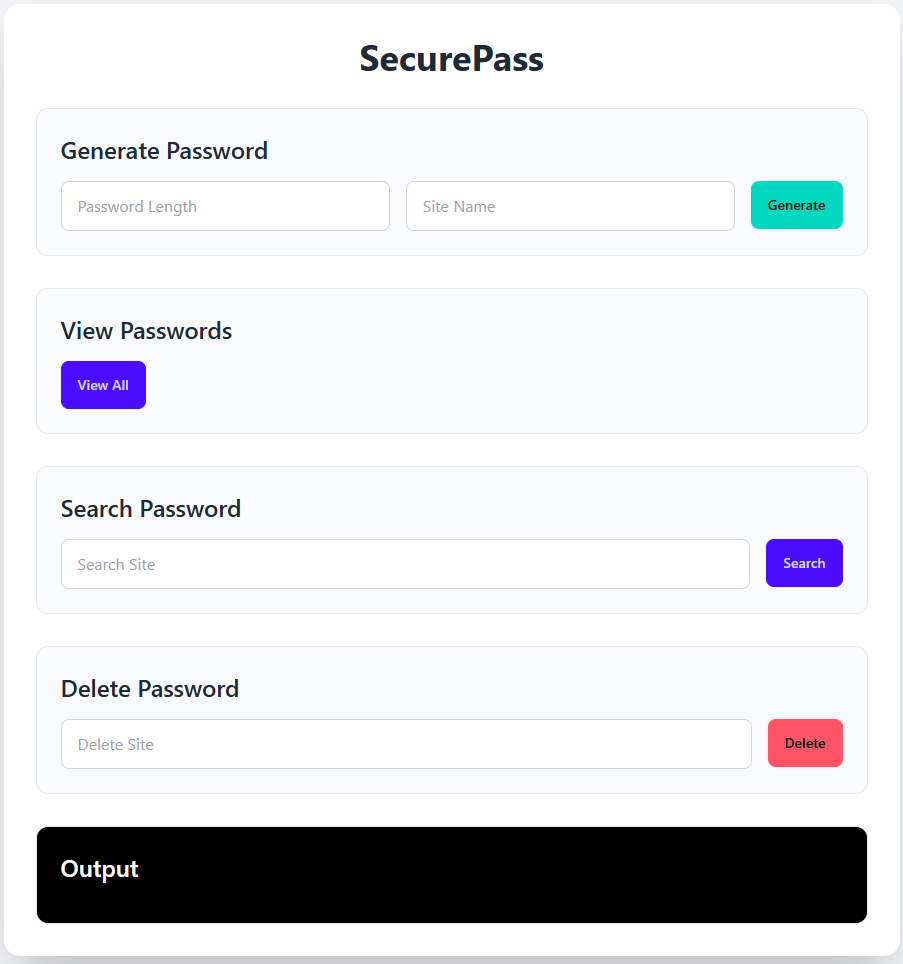

# 🔐 SecurePass GUI

A cross‑platform desktop password manager built with **Electron** and a **Bash** backend. Generate, store, view, search, and delete passwords for different websites – all from a clean, modern interface.



## ✨ Features

- ✅ **Generate** strong random passwords (custom length + user name)
- 👁️ **View** all stored site‑password pairs
- 🔍 **Search** for a specific site’s password
- 🗑️ **Delete** a password entry
- 🎨 **Responsive UI** – Tailwind CSS + DaisyUI
- 📄 **Plain text storage** – passwords saved in `passwords.txt` (simple and editable)


## 🧰 Prerequisites

- **Node.js** (v16 or later) + **npm**
- **Bash** (required for `manager.sh`):
  - **Windows**: Install [Git Bash](https://git-scm.com/download/win) (includes `bash`).  
    *Make sure `bash` is available in your PATH.*
  - **macOS / Linux**: Bash comes pre‑installed.

## 🚀 Installation & Setup

1. **Clone or download** the project.
2. **Open a terminal** inside the project folder
  -go to gui-app(*cd gui-app*) (where `package.json` lives).
3. **Install dependencies**:(inside gui-app folder)
   ```bash
   npm install electron --save-dev

## Run the GUI
 *inside gui-app folder(using terminal)* 
 - npm start
